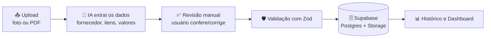

# Nota Fiscal IA Reader

Leitor de notas fiscais com IA: tire uma foto (ou envie um PDF), a IA extrai fornecedor, itens e valores automaticamente, e você acompanha seus gastos num histórico com dashboard.

[](https://nota-fiscal-ia-reader.vercel.app/demo) 
[](https://github.com/luisesteves7/nota-fiscal-ia-reader/actions/workflows/ci.yml)
[](LICENSE)

**[🔗 Testar demo ao vivo](https://nota-fiscal-ia-reader.vercel.app/demo)** — sem precisar criar conta, com notas de exemplo fictícias.

**[🚀 Acessar o app no ar](https://nota-fiscal-ia-reader.vercel.app)**

---

## O problema que resolve

Guardar nota fiscal é chato, e organizar gasto por fornecedor/mês manualmente é mais chato ainda. Esse projeto tira uma foto ou PDF da nota, deixa a IA extrair os dados estruturados, e cuida do resto: validação, histórico pesquisável e um dashboard de gastos — sem planilha.

## Como funciona



A IA nunca salva nada direto — o resultado sempre passa por uma tela de revisão antes de ir pro banco, porque campos como CNPJ podem sair errados na leitura automática.

## Funcionalidades

- **Upload com preview** — foto (JPG/PNG/WEBP) ou PDF, até 10MB
- **Extração via IA** — fornecedor, CNPJ, data, número da nota e itens (descrição, quantidade, valor unitário e total)
- **Tela de revisão** — todo campo é editável antes de salvar; a IA sinaliza quando a confiança da leitura é baixa
- **Histórico** — lista com busca, status de processamento e link pro arquivo original
- **Dashboard** — total gasto, ticket médio, gasto por mês e por fornecedor (gráficos)
- **Modo demo** ([`/demo`](https://nota-fiscal-ia-reader.vercel.app/demo)) — fluxo completo com notas fictícias, sem precisar de conta nem de nenhuma chave de API configurada
- **RLS no Supabase** — cada usuário só enxerga as próprias notas, a nível de banco de dados

## Stack

| Camada | Tecnologia | Por quê |
|---|---|---|
| Frontend/Backend | Next.js 14 (App Router) + TypeScript | Server Components evitam expor lógica/chaves no client; um único deploy pra front e API |
| Estilo | Tailwind CSS | Consistência rápida sem escrever CSS à mão |
| IA (extração) | [Groq](https://groq.com) (modelo com visão) | Latência baixa o suficiente pra manter o fluxo de upload fluido |
| Validação | Zod | O JSON que a IA devolve nunca é confiável por padrão — é revalidado no servidor antes de tocar o banco |
| Banco/Auth/Storage | Supabase (Postgres) | Row Level Security nativa, Storage e Auth num único serviço, sem infra própria |
| Gráficos | Recharts | Simples de compor com dados já agregados no servidor |
| Testes | Vitest | Rápido, mesma configuração serve unit tests de lib e de validação |
| CI | GitHub Actions | Lint + typecheck + testes + build a cada push |
| Deploy | Vercel | Integração nativa com Next.js, preview por PR |

## Rodando localmente

```bash
git clone https://github.com/luisesteves7/nota-fiscal-ia-reader.git
cd nota-fiscal-ia-reader
npm install
cp .env.example .env.local   # preencha com suas chaves (veja comentários no arquivo)
npm run dev
```

Acesse `http://localhost:3000`. Se quiser ver o app funcionando **sem configurar nenhuma chave**, vá direto em `http://localhost:3000/demo` — essa rota não depende de nenhuma variável de ambiente.

Para usar a extração e o banco de verdade, você vai precisar de:
- Um projeto no [Supabase](https://supabase.com) (rode as migrations em `supabase/migrations/` no SQL Editor)
- Uma chave de API da [Groq](https://console.groq.com/keys)

Detalhes de cada variável estão comentados no `.env.example`.

## Estrutura de pastas

```
src/
├── app/
│   ├── page.tsx              # tela de upload (home)
│   ├── historico/            # lista de notas + edição
│   ├── dashboard/            # gráficos de gasto
│   ├── demo/                 # modo demo, sem backend real
│   ├── login/                # autenticação
│   └── api/invoices/         # rotas de API (extração e CRUD)
├── components/                # componentes de UI reutilizáveis
├── lib/
│   ├── ai/                   # chamada à IA e prompt de extração
│   ├── dashboard/             # agregação dos dados pro dashboard (testado)
│   ├── demo/                  # dados fictícios do modo demo
│   ├── supabase/              # clientes Supabase (server/client)
│   └── validation/            # schemas Zod
└── middleware.ts               # sessão Supabase + proteção de rotas
supabase/migrations/            # schema do banco (SQL puro)
examples/                       # notas fictícias usadas no modo demo
```

## Decisões técnicas

- **Por que validar com Zod antes de salvar?** O retorno da IA é texto estruturado, não uma garantia de tipo. Sem revalidar no servidor, um campo mal formatado (ex: data fora do padrão) quebraria silenciosamente o histórico ou o dashboard mais tarde.
- **Por que RLS no Supabase em vez de checar `user_id` na aplicação?** Porque a regra de acesso fica garantida no banco, não em cada endpoint — mesmo um bug numa rota de API não vaza dado de outro usuário.
- **Como lido com erro de leitura da IA?** A nota fica com `status = 'error'` e a mensagem original do erro é guardada — o usuário vê isso no histórico em vez de a nota simplesmente sumir.
- **Por que o modo demo não usa o Supabase?** Pra funcionar mesmo pra quem clonou o repo sem configurar nada ainda. Os dados ficam só em memória no navegador (`useState`); recarregar a página reseta tudo.
- **Por que Groq em vez de chamar a IA direto do client?** A chave de API nunca pode chegar ao navegador — a extração acontece numa rota de API do Next.js, que é a única peça com acesso à chave.

## Roadmap

- [ ] Exportar histórico filtrado para CSV/Excel
- [ ] Upload em lote (várias notas de uma vez, processadas em fila)
- [ ] Categorização automática de gasto (alimentação, transporte, escritório...)
- [ ] PWA — instalar no celular e funcionar quase como app nativo
- [x] Deploy ao vivo com modo demo público na Vercel

## Privacidade

Os dados usados no modo demo (`/examples`) são 100% fictícios — nenhum CNPJ, fornecedor ou valor corresponde a empresa real. Em produção, cada usuário só tem acesso às próprias notas, garantido por Row Level Security no Postgres.

## Licença

[MIT](LICENSE)  